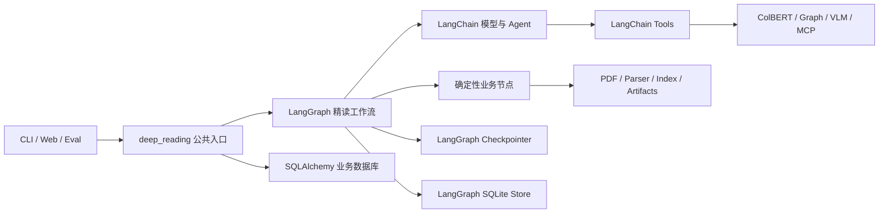
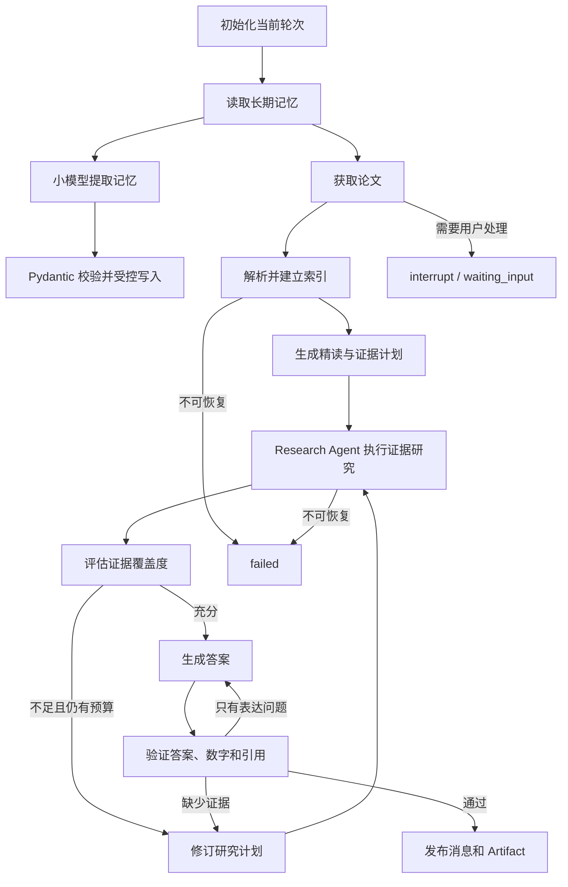
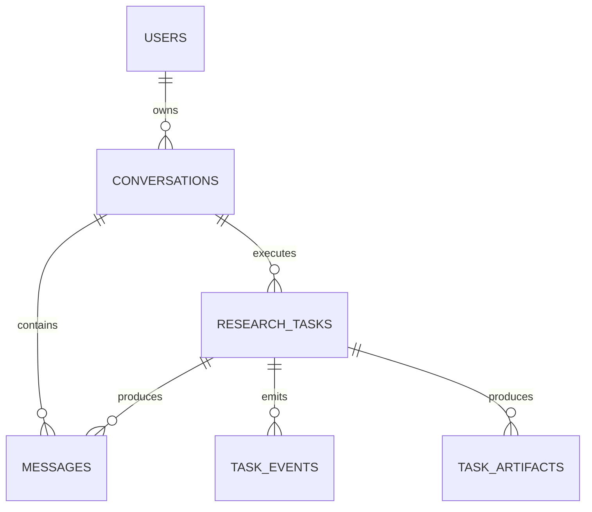
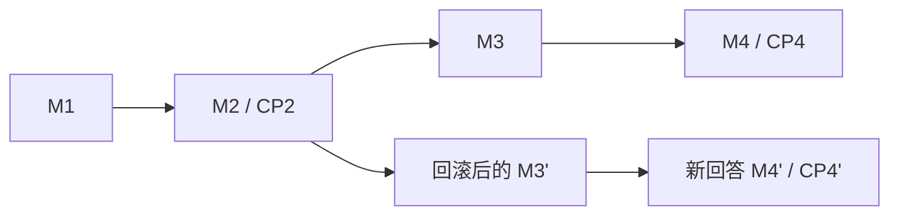

# PaperPilot LangGraph 重构目标设计

> Codex only：本文记录 2026-08-05 至 2026-08-06 讨论并逐节确认的目标架构。本文是设计规范，不代表已经批准安装依赖、修改数据库、切换接口、删除旧运行时或执行数据迁移。

## 1. 背景

PaperPilot 当前已经具备可运行的 CLI、Web、Eval、检索、MCP、SQLite 任务存储和后台执行能力，但演进过程中形成了职责重叠：

- Web 真实执行仍通过 `paperpilot.web.workflow.WorkflowRunner` 调用 `paperpilot.conversation.run()`，进入旧的同步 Agent 循环。
- `paperpilot/agent/` 已经包含另一套可测试的 RunStore、Driver、ToolExecutor 和持久化控制能力，但没有成为 Web 生产路径的统一入口。
- `planned_retrieval` 同时承担查询规划、多轮检索、证据汇总和可选验证，完整工作流被隐藏在 ColBERT MCP 工具内部。
- Eval 除运行、记录和评分外，还包含答案修复、证据选择等可能改变正式答案的逻辑，运行时与评测边界不够清楚。
- Web 业务数据库由一个大型手写 `TaskStore` 负责用户、登录 Session、任务、事件、Artifact、建表和兼容迁移；继续增加会话、消息、分支和 Run 会进一步放大耦合。

本次重构的首要目的不是追求更多抽象，而是让框架的原生概念直接对应 PaperPilot 的业务概念，使代码能够按模块理解、独立测试和逐步升级。

## 2. 已确认的核心决策

1. 采用渐进式兼容迁移，迁移期间保留现有 CLI、Web API、Eval 和 SQLite 使用方式。
2. 使用 LangGraph 负责论文精读的宏观状态机、节点转移、循环、checkpoint、暂停和恢复。
3. 使用 LangChain 负责模型初始化、结构化模型调用、工具注册和工具型 Agent。
4. 只有证据研究节点使用 LangChain `create_agent` 工具循环；计划、覆盖判断、写作和验证使用 LangChain structured output。
5. 使用 Pydantic 定义 API 和 LLM 节点的数据契约；LangGraph 主 State 使用 `TypedDict`，节点边界显式执行 Pydantic 校验。
6. 使用 FastAPI 继续承载 Web/API，Celery 第一阶段继续承载跨进程后台调度。
7. 业务数据库继续使用 SQLite，但从手写 `sqlite3/TaskStore` 迁移到 SQLAlchemy 2，并使用 Alembic 管理 Schema 版本。
8. 一条 PaperPilot 论文会话对应一个 LangGraph `thread_id`；`conversation.id` 直接作为 `thread_id`。
9. 现有 `research_tasks` 复用为“生成一轮回复的执行记录”，不额外建立重复的 `runs` 表。
10. 会话回滚采用非破坏性分支：从历史 checkpoint 创建新路径，保留原消息和 checkpoint 历史。
11. 使用独立的 LangGraph SQLite Store 保存跨 Conversation 的用户画像、长期偏好、重要声明和待确认记忆；业务数据库仍保存用户与产品数据，LangGraph Checkpointer 仍只保存 thread 内执行状态。
12. 不建立 Ports/Adapters/Repository 等自定义多层体系；只保留框架要求的模型、节点、工具和少量业务函数。

## 3. 目标系统边界



### 3.1 LangGraph 的职责

- 定义业务节点、固定边和条件边。
- 保存和恢复 `DeepReadingState`。
- 控制证据不足时的补充检索循环。
- 控制答案验证失败后的重新检索或重新写作。
- 实现 interrupt、resume、checkpoint history、replay 和 fork。
- 编排长期记忆的读取、结构化提取和受控写入节点。
- 暴露节点级流式事件，供 Runner 转换成产品事件。

LangGraph 不负责 prompt 管理、模型供应商配置、具体检索算法、业务用户权限或前端消息持久化。

### 3.2 LangChain 的职责

- 统一初始化 ChatModel。
- 为简单节点提供 `with_structured_output` 或等价结构化调用。
- 使用独立、低成本、非思考模式的 ChatModel 生成结构化 `MemoryExtraction`。
- 为证据研究节点提供 `create_agent` 和受限工具集合。
- 处理工具调用参数、模型响应和 structured output 的有限重试。
- 对接 ColBERT、图检索、VLM 和 MCP 工具。

内部 Research Agent 第一阶段不配置独立持久化 Checkpointer。业务恢复由外层 LangGraph 管理，避免父 Graph 和内部 Agent 同时维护两套持久化时间线。

### 3.3 Pydantic 的职责

Pydantic 用于定义并验证：

- `DeepReadingRequest`
- `ReadingPlan`
- `EvidenceRequirement`
- `SearchAction`
- `ResearchResult`
- `EvidenceItem`
- `CoverageReport`
- `AnswerDraft`
- `VerificationReport`
- `DeepReadingResult`
- `MemoryContext`
- `MemoryExtraction`
- `MemoryDecision`
- 会话、消息、回滚等 API 请求与响应

LangGraph State 本身使用 `TypedDict`，其中的复杂字段保存 Pydantic 模型的 JSON 兼容序列化结果。每个节点读取时执行 `model_validate`，写回前执行 `model_dump(mode="json")`，不能依赖 LangGraph 只在图入口处进行的 State 校验。

## 4. 论文精读状态机

论文精读被定义为“固定宏观 SOP + 局部 Agent 决策”，而不是完全自由的 ReAct 循环。



### 4.1 确定性节点

- 初始化当前轮次。
- 从认证用户的 Store namespace 读取长期记忆并建立本轮 `MemoryContext`。
- 校验 `MemoryExtraction` 后，以可信运行上下文执行记忆写入、候选或撤销动作。
- 获取论文。
- 解析、切分和建立索引。
- 按计划调用确定性工具或保存结果。
- 发布消息、事件和 Artifact。

### 4.2 LLM 结构化节点

- `plan_reading` 返回 `ReadingPlan`。
- `assess_coverage` 返回 `CoverageReport`。
- `write_answer` 返回 `AnswerDraft`。
- `verify_answer` 返回 `VerificationReport`。
- `extract_memory` 使用独立小模型返回 `MemoryExtraction`，不使用 Agent 或工具循环。

这些节点不自行持续调用工具，是否进入下一阶段由 LangGraph 条件边决定。

### 4.3 Research Agent 节点

`research_evidence` 使用 LangChain `create_agent`，可访问当前轮次允许的 ColBERT、段落获取、图检索、VLM、附录检索等工具。它负责“如何找证据”，但不能：

- 结束整个 Graph。
- 跳过覆盖判断或答案验证。
- 直接修改会话权限和任务状态。
- 直接调用 Store 或决定用户 namespace。
- 无限制调用工具。
- 自己维护另一套业务 checkpoint。

它必须返回经过 Pydantic 校验的 `ResearchResult`。

## 5. `planned_retrieval` 的迁移边界

现有 `planned_retrieval` 已经包含查询规划、多次 ColBERT 搜索、证据池和可选验证，因此本质上是一段隐藏在 MCP 工具内部的工作流。

- 兼容阶段：`research_evidence` 节点调用现有 `planned_retrieval`，保持结果与行为边界。
- 目标阶段：将查询规划、底层搜索、证据合并和覆盖判断逐步迁入 LangGraph/LangChain 节点。
- 最终 ColBERT MCP 只保留单次搜索、获取文段等底层能力，不再暗中编排完整论文精读流程。

拆分前必须建立新旧结果对比和检索回归测试，不能在接入 LangGraph 时同时重写检索算法。

## 6. 代码组织

采用按论文精读功能聚合的包，避免建立全局 Ports/Adapters 层：

```text
paperpilot/
├── deep_reading/
│   ├── __init__.py
│   ├── graph.py
│   ├── runner.py
│   ├── state.py
│   ├── schemas.py
│   ├── tools.py
│   ├── memory/
│   │   ├── schemas.py
│   │   ├── extraction.py
│   │   └── nodes.py
│   ├── nodes/
│   │   ├── preparation.py
│   │   ├── planning.py
│   │   ├── research.py
│   │   ├── synthesis.py
│   │   ├── verification.py
│   │   └── finalization.py
│   └── llm/
│       ├── planner.py
│       ├── research_agent.py
│       ├── writer.py
│       └── verifier.py
├── retrieval/
├── tools/
├── web/
└── eval/
```

边界规则：

- `graph.py` 只负责 StateGraph 的节点和边，不写 SQL、prompt 或检索算法。
- `runner.py` 负责编译/调用/恢复 Graph、传递 thread 配置、消费事件和更新外部运行状态。
- `nodes/` 中每个文件只对应一个业务阶段。
- `llm/` 负责 prompt、模型调用和结构化结果。
- `memory/` 只负责长期记忆契约、结构化提取和 Graph 节点；直接使用 LangGraph Store，不再包装 Repository。
- `tools.py` 使用 LangChain 工具定义直接包装底层能力，不实现跨阶段业务循环。
- `retrieval/`、MCP 和 VLM 不导入 `deep_reading.graph`。
- Web、CLI 和 Eval 只能调用公共入口，不直接调用内部节点。

公共运行入口目标为：

```text
deep_reading.run(request) -> DeepReadingResult
deep_reading.stream(request)
deep_reading.resume(conversation_id, checkpoint_id, input)
```

具体同步/异步函数签名在相应实施子项目中确定，但必须保持单一入口原则。

## 7. 会话、消息、回复运行和 Checkpoint

用户可理解的产品模型只保留五个概念：

| 概念 | 含义 |
|---|---|
| Conversation | 围绕一篇论文的连续会话 |
| Message | 用户问题、Assistant 回答或系统消息 |
| ResearchTask / Run | 为一条用户消息生成一次回复的执行记录 |
| Checkpoint | LangGraph 在节点边界保存的内部 State 快照 |
| Memory | 跨 Conversation 生效、可由用户查看和撤销的长期信息 |

`sessions` 继续只表示登录 Session；论文会话统一命名为 `conversations`，避免混淆。

### 7.1 业务数据关系



### 7.2 Conversation

目标字段：

```text
id
user_id
title
paper_ref
head_message_id
head_checkpoint_id
created_at
updated_at
archived_at
```

约束：

- `conversation.id` 直接作为 LangGraph `thread_id`。
- 客户端不能绕过业务数据库直接提交任意 `thread_id`。
- API 必须先用当前登录 `user_id` 验证 Conversation 所有权，再调用 Graph。
- 一条 Conversation 同一时刻最多有一个处于 `pending`、`running` 或 `waiting_input` 的 ResearchTask；`waiting_input` 通过恢复原 Task 继续，不另建并发 Task。不同 Conversation 可以并发。
- `head_checkpoint_id` 是指向独立 LangGraph Checkpoint 数据库的逻辑引用，不建立跨数据库外键。

### 7.3 Message

目标字段：

```text
id
conversation_id
task_id
parent_message_id
role
content
status
metadata_json
created_at
```

业务数据库中的 Message 是前端多轮显示的唯一事实来源；不从 Checkpoint 反向解析 UI 消息。`parent_message_id` 形成消息树，Conversation 的 `head_message_id` 指向当前活跃分支末端。`task_id` 允许为空，但正常提问流程中，用户 Message 和对应 Assistant Message 都关联同一个 ResearchTask；只有系统消息、历史导入或尚未触发运行的草稿消息可以不关联 Task。

### 7.4 ResearchTask 复用为 Run

现有 `research_tasks` 保留并扩展：

```text
conversation_id
base_checkpoint_id
final_checkpoint_id
result_quality
```

目标 Task 状态为 `pending`、`running`、`waiting_input`、`completed`、`failed`、`cancelled`。`result_quality` 在运行未结束时为空，完成后为 `complete` 或 `partial`，从而避免把“受预算限制但仍可交付”误判为执行失败。

原有 `question`、`depth`、`status`、时间字段、事件和 Artifact 继续使用。阶段 1 必须保持当前状态值和 API 行为；新增状态及其对外表现要在阶段 2/3 的相应 API 设计中显式确认，不能通过基础迁移静默改变。迁移期间保留 `research_tasks.user_id` 以兼容现有 API；一旦 `conversation_id` 非空，Conversation 的 `user_id` 是权威所有权来源。是否在未来删除冗余 `research_tasks.user_id` 不属于本次重构范围，需要单独确认。

## 8. 多轮追问

同一 Conversation 的后续追问继续使用同一个 LangGraph `thread_id`：

1. FastAPI 验证 Conversation 属于当前用户。
2. 在一个业务事务中保存用户 Message 并创建 ResearchTask。
3. Runner 以 `conversation.id` 调用 Graph，把认证 `user_id` 放入不可由模型修改的 Runtime Context，并把本轮 Task ID 和问题写入 State。
4. Graph 从该 thread 的活跃 checkpoint 继续；`load_memory` 节点从认证用户 namespace 读取有效长期记忆并建立本轮 `MemoryContext` 快照。
5. 当前用户消息的明确要求优先于历史长期记忆。
6. 完成 `MemoryContext` 快照后，记忆提取分支与论文精读主分支并行；小模型分析当前消息，通过校验后直接保存具有明确长期保存意图的声明，或生成待确认候选。
7. 发布节点保存 Assistant Message、Artifact 和 `final_checkpoint_id`。
8. Conversation 更新 `head_message_id` 和 `head_checkpoint_id`。

跨轮保留的 Graph State：

- 论文、PDF Artifact 和索引引用。
- 已确认的证据 ID 和必要的研究上下文。
- 对话摘要或消息引用。
- Graph/State Schema 版本。

每轮必须重置：

- `current_task_id`
- `current_question`
- 当前 `ReadingPlan`
- 当前缺口和当前轮证据增量
- 草稿、验证报告、迭代、预算和错误
- 当前轮加载的 `MemoryContext`；新一轮开始时重新从 Store 构造并覆盖
- 记忆提取的临时响应和重试状态

Graph State 不保存 PDF、完整索引、大量 chunk、prompt 模板或任意框架 Client 对象。

## 9. 会话回滚与分支

“回滚”定义为非破坏性 fork，不删除原消息或原 checkpoint：



流程：

1. 用户选择历史 Assistant Message。
2. API 验证 Message 和关联 Task 都属于当前 Conversation 和用户。
3. 找到该 Task 的 `final_checkpoint_id`。
4. 更新 Conversation 的活跃消息头和 checkpoint 头。
5. 用户提交新问题时，从该 checkpoint 使用 LangGraph replay/fork 能力产生新分支。
6. 新消息通过 `parent_message_id` 挂在选定历史消息之后。
7. 原分支继续保留，可供查看或再次切换。

不支持“只隐藏消息但继续使用最新 State”，也不支持未经额外确认的硬删除式回滚。

精确 replay/debug 一个历史 Task 时使用 checkpoint 中的 `MemoryContext` 快照，不重新读取当前 Store；否则用户后来修改长期记忆会改变历史结果。用户从历史 Message fork 后提交一条新的问题时，新 ResearchTask 必须重新读取当前 Store 并覆盖本轮 `MemoryContext`，不能永久继承历史画像。

初始版本只归档 Conversation，不物理删除 Message、Task 或 checkpoint。Checkpoint 和 Store 记忆的保留策略以及跨三个数据库的物理清理属于独立的破坏性变更，必须另行设计和确认。

## 10. 持久化边界

### 10.1 SQLAlchemy 业务数据库

继续使用默认 SQLite 业务文件，目标表为：

```text
users
sessions
conversations
messages
research_tasks
task_events
task_artifacts
alembic_version
```

SQLAlchemy 接管当前 `TaskStore` 的用户、登录、任务、事件、Artifact、查询和事务逻辑。Alembic 接管建表和版本迁移，应用启动不再逐步扩展运行时 `ALTER TABLE` 兼容逻辑。

不创建自定义 Repository/Port。FastAPI 使用请求级 SQLAlchemy Session，`conversations.py`、`runs.py` 等聚合少量明确的业务操作。

### 10.2 LangGraph Checkpoint 数据库

使用独立持久化 Checkpointer，例如本地 SQLite 文件：

```text
data/langgraph/checkpoints.sqlite3
```

它保存 `thread_id`、`checkpoint_id`、State 快照、metadata 和 pending writes。PaperPilot 不为这些框架内部表建立 SQLAlchemy 模型，也不直接修改表结构。

### 10.3 LangGraph 长期记忆 Store

使用 LangGraph 官方 `SqliteStore` 或 `AsyncSqliteStore` 的独立 SQLite 文件：

```text
data/langgraph/store.sqlite3
```

Store 保存跨 Conversation 的用户画像、长期偏好、重要声明和待确认候选。它使用 LangGraph Store 自身的初始化/升级机制，PaperPilot 不为其内部表建立 SQLAlchemy 模型，也不通过 Alembic 修改 Store 表结构。部署时将 Checkpointer 和 Store 的 setup 作为显式步骤，不把潜在迁移隐藏在普通请求中。

实现时必须锁定当时可用的安全稳定版本；`langgraph-checkpoint-sqlite < 3.0.1` 存在已公开的 SQL 注入漏洞，不得使用。Store 数据库继续使用 SQLite，不因引入长期记忆切换 PostgreSQL。

FastAPI 与 Celery 进程各自创建并关闭 Store 连接，不跨线程或 fork 共享 SQLite connection。实现阶段必须验证 WAL、busy timeout、并发读写和 worker redelivery；若真实压力探针无法满足 PaperPilot 的并发需求，再单独评估其他 `BaseStore` 后端，不能在本次设计中预先切换数据库。

### 10.4 文件和索引

PDF、解析结果、ColBERT 索引、VLM 缓存和 traces 继续保存在现有文件/索引存储。业务数据库和 Graph State 只保存引用、校验值和必要元数据。

### 10.5 Source of Truth

| 数据 | 权威来源 |
|---|---|
| 用户、权限、Conversation、Message、Task、Event、Artifact | SQLAlchemy 业务数据库 |
| Graph 当前执行位置和历史 State | LangGraph Checkpointer |
| 跨 Conversation 的用户画像、偏好、声明和候选记忆 | LangGraph Store |
| PDF、chunk、索引、证据正文 | 文件/索引/Artifact 存储 |
| 前端聊天记录 | Message 表 |
| 当前活跃消息分支和 checkpoint | Conversation 的 head 指针 |

### 10.6 跨存储一致性

业务数据库、Checkpoint 数据库和 Store 数据库不能共享一个 SQL 事务，因此不假设三者原子提交。ResearchTask 是回复运行的恢复与对账单元，顺序约束为：

1. 先在业务事务中创建用户 Message 和 ResearchTask。
2. Graph 成功形成 checkpoint 后，把 checkpoint ID 写回该 Task。
3. 发布阶段用稳定幂等键写入 Assistant Message 和 Artifact。
4. 只有 Assistant Message 与最终 checkpoint 都已确认后，才更新 Conversation 的两个 head 指针并完成 Task。

如果进程在任一步之间退出，Runner 根据 Task 状态、已记录的 checkpoint ID 和幂等产物恢复或对账；不能因为业务库已写入就假定 checkpoint 一定存在，也不能把 Checkpointer 中的最新快照直接展示成一条已完成回复。

记忆提取和写入是独立的可审计副作用：它可以与论文精读并行，失败不把可交付的论文回答改成失败，但必须产生可见的记忆状态或事件。明确声明写入失败时不能向用户声称“已经记住”，并应使用稳定幂等键有限重试。

## 11. 长期记忆设计

### 11.1 Namespace 与记录结构

Store namespace 固定为：

```text
(authenticated_user_id, "memories", kind)
```

长期记忆初版允许的 `kind` 为 `profile`、`preference`、`instruction`、`declaration` 和 `candidate`。`user_id`、数据库路径、namespace、来源 Conversation 和来源 Message 都从认证与运行上下文取得，模型无权生成或覆盖。

每条 Store Item 的 value 至少包含：

```text
memory_id
key
value
status
explicitness
target_kind
source_conversation_id
source_message_id
supersedes_memory_id
created_at
```

`status` 只允许 `active`、`pending`、`superseded`、`revoked` 或 `rejected`；`explicitness` 区分明确长期保存意图、仅陈述的稳定事实和模型推断。候选记录存放在 candidate namespace，并用 `target_kind` 保留确认后应进入的正式类型。

用户修改长期记忆时创建新版本，并通过 `supersedes_memory_id` 关联旧版本；旧版本标记为 `superseded`。撤销初期使用失效状态而非物理删除，真正物理清理需要另行确认。所有活跃记忆必须能够追溯到来源 Message。

### 11.2 结构化记忆提取

不使用 `if "记住" in message` 等关键词分支，也不把开放的 `store.put` 工具交给 Agent。每条用户消息由独立、低成本、非思考模式的小模型进行一次语义提取，并返回：

```text
MemoryExtraction
└── items[]: MemoryDecision
    ├── action: remember | candidate | forget
    ├── kind: profile | preference | instruction | declaration
    ├── key
    ├── value
    └── evidence
```

- `remember`：用户在语义上明确要求长期保存，或明确给出面向未来持续生效的偏好/指令；通过校验后直接写入正式 namespace。是否明确不依赖特定关键词。
- `candidate`：用户陈述了可能长期有效但没有明确保存意图的事实，或模型根据上下文推断出可能长期信息；只写入候选 namespace，确认前不得进入回答上下文。
- `forget`：用户明确撤销或纠正旧记忆，生成失效/替代操作。

Pydantic 校验 action、kind、字段长度、每条消息的最大提取数量，并验证 evidence 来自允许的消息上下文。业务执行函数只根据校验后的 action 操作 Store；这属于确定性状态转移，不承担自然语言语义判断。Store key 必须规范化，写入幂等键由 `source_message_id + action + kind + normalized_key` 等可信字段稳定生成。

### 11.3 读取、优先级与回放

每轮开始从 Store 读取该用户数量受限的有效记忆，构造只读 `MemoryContext`。长期记忆初版不增加第二次“记忆相关性判断”模型调用，也不启用向量索引：用户画像和重要声明预计数量较少，先在 `MEMORY_MAX_ACTIVE_ITEMS` 限制内加载有效记录，以保持成本和行为可预测。超出上限时按 `instruction`、`preference`、`declaration`、`profile` 的确定性优先级和版本时间选择，并产生容量告警，不能静默丢弃。达到实际规模阈值后，才单独评估语义索引和 embedding 成本。

上下文优先级为：系统安全与产品规则高于所有用户内容；当前用户消息的明确要求高于历史长期记忆；正式长期记忆高于旧对话摘要；候选记忆完全不参与回答。Store 内容始终作为不可信的用户上下文引用，不能提升为隐藏的系统提示词。

本轮实际使用的少量记忆值保存在 `MemoryContext` State 快照中。精确 replay/debug 使用该快照；从历史点开始的新用户轮次重新读取当前 Store。这样既保证历史 Task 可复现，又让新分支遵循用户当前偏好。

### 11.4 用户确认与管理

候选记忆不通过 interrupt 阻断论文精读。回答完成后，Web 可以显示非阻塞确认项，用户可选择记住或忽略。产品必须支持查看正式记忆和候选、确认或拒绝候选、纠正内容、撤销记忆并查看来源 Message。

### 11.5 配置、成本与可观测性

记忆模型独立配置，不能在代码中复用或写死主研究模型名称：

```text
MEMORY_MODEL
MEMORY_EXTRACTION_ENABLED
MEMORY_MAX_INPUT_TOKENS
MEMORY_MAX_ITEMS_PER_MESSAGE
MEMORY_MAX_ACTIVE_ITEMS
```

输入只包含稳定的短规则、当前用户消息、必要的上一条 Assistant 消息和精简 schema；没有记忆时输出空 `items`。每次提取单独记录模型名、输入/输出 token、延迟、校验重试和估算成本。现有 `.env.example` 中的旧模型标识必须在运行时子项目中根据当时供应商支持情况单独确认和更新，本设计不授权当前修改配置。

## 12. 错误、重试和幂等

| 类型 | 处理方式 |
|---|---|
| API 限流、MCP 超时、临时网络错误 | LangGraph 节点有限重试 |
| Agent 工具参数或查询失败 | Research Agent 在工具预算内调整 |
| Pydantic structured output 校验失败 | LangChain 有限重试，耗尽后节点失败 |
| 记忆提取模型或校验失败 | 不阻断论文回答；记录独立状态并有限重试 |
| 明确记忆写入失败 | 不声称已经记住；向用户显示失败状态并使用幂等键重试 |
| 候选记忆失败 | 不进入回答上下文；可稍后重新提取，不影响 Task 答案 |
| 证据不足 | 不是异常；进入补充研究分支 |
| PDF 不可访问或需要用户补充输入 | `interrupt`，Task 进入 `waiting_input` |
| 不可恢复的解析/索引错误 | Task 进入 `failed` 并记录结构化错误 |
| 研究预算耗尽但可给出受限结论 | Task 完成，结果质量标记为 `partial` |
| 用户取消 | 在安全节点边界停止，Task 进入 `cancelled` |

所有外部写入必须支持恢复后的重复执行：

- 论文下载按来源和内容指纹去重。
- 索引按 PDF hash、解析版本和索引版本去重。
- 证据按证据指纹去重。
- Assistant Message 和 Artifact 按 Task 与产物类型幂等发布。
- Store 写入按来源 Message、action、kind 和规范化 key 生成稳定幂等键。
- 事件使用稳定的幂等键或明确允许的追加语义。
- interrupt 之前发生的写入不能因节点重新执行而重复。

## 13. API 与兼容边界

新增目标 API：

```text
POST   /api/conversations
GET    /api/conversations
GET    /api/conversations/{conversation_id}
PATCH  /api/conversations/{conversation_id}
GET    /api/conversations/{conversation_id}/messages
POST   /api/conversations/{conversation_id}/messages
POST   /api/conversations/{conversation_id}/rollback
GET    /api/memories
POST   /api/memories/{memory_id}/confirm
POST   /api/memories/{memory_id}/reject
PATCH  /api/memories/{memory_id}
DELETE /api/memories/{memory_id}
```

现有 `/api/tasks` 在迁移阶段继续可用。具体请求/响应字段、HTTP 状态码和旧 API 的退出时间必须在“会话与消息”实施子项目中单独确认和测试，不在基础数据库阶段静默改变。

初始会话 API 通过 `PATCH` 设置 `archived_at` 实现软归档，不提供会连带删除 Message、Task 或 checkpoint 的硬删除接口。

记忆 API 必须从认证用户推导 namespace，不能接受客户端提交的任意 `user_id` 或 namespace。初始 `DELETE /api/memories/{memory_id}` 表示撤销使用而非物理清除；确认、拒绝、纠正和撤销必须保留来源与版本链。具体请求/响应字段和状态码在长期记忆实施子项目中单独确认。

CLI 和 Eval 可创建临时/显式 Conversation，但不能直接依赖内部节点。Eval 的目标职责收敛为运行、记录、评分和诊断；任何会修改正式答案的修复逻辑必须明确标记为评测后处理，不得默认混入生产运行结果。

## 14. 渐进式迁移

### 阶段 1：SQLAlchemy 与 Alembic 数据基础

- 用 SQLAlchemy 1:1 映射当前五张业务表。
- 建立支持空数据库和现有数据库的 Alembic 基线。
- 保持当前认证、任务、事件、Artifact 和 API 行为。
- `TaskStore` 可作为临时兼容入口，但新数据库访问以 SQLAlchemy 为目标。
- 当前本地数据库中的无归属旧任务不得自动删除；迁移期间保留为无归属 legacy 数据，无法通过登录用户 API 访问。

### 阶段 2：Conversation 与 Message

- 新增 Conversation 和 Message 表。
- 扩展 ResearchTask 的 Conversation 与 checkpoint 字段。
- 实现创建、列表、标题、归档、消息历史和用户隔离。
- 暂时继续调用旧 `conversation.run()`，先验证产品数据模型。

### 阶段 3：LangGraph 与 LangChain 新运行时

- 建立 `paperpilot/deep_reading/`。
- 接入 LangGraph 持久化 Checkpointer。
- 接入独立 LangGraph SQLite Store、长期记忆读取节点和结构化 `MemoryExtractor`。
- 接入 LangChain 模型、structured output、Research Agent 和工具。
- 先把现有 `planned_retrieval` 作为兼容节点。
- 建立新旧核心回答路径与检索结果对比。

### 阶段 4：多轮追问与回滚

- 使用 Conversation ID 作为 thread ID。
- 实现跨轮 State 与本轮 State 的分离。
- 保存 Task 的起始/最终 checkpoint。
- 实现消息树、活跃 head 和非破坏性 fork。
- 实现长期记忆候选确认、查看、纠正和撤销接口及 Web 交互。

### 阶段 5：入口切换与旧运行时退出

- 依次切换 Web、CLI、Eval 到统一入口。
- 停止扩展旧 Agent Loop 和未接入生产路径的自定义控制平面。
- 只有在兼容、恢复、并发和 Eval 边界验证通过后，才单独提出旧文件/表/配置删除清单并等待确认。

本设计不授权删除 `paperpilot/agent/`、旧 loop、旧 `planned_retrieval` 或现有数据库字段。

## 15. 验证标准

### 15.1 数据库

- 空 SQLite 能从 Alembic 零版本升级到最新版本。
- 当前 SQLite 能在不丢失用户、任务、事件、Artifact 的情况下升级。
- 用户只能查询和操作自己的 Conversation、Message 和 Task。
- 用户只能查询和操作自己 namespace 下的正式记忆与候选。
- 事务失败不会留下只有用户 Message、没有 Task 的半成品，或反向半成品。
- SQLite 外键、WAL、busy timeout 和并发写入行为有真实数据库测试。

### 15.2 Graph 与 Agent

- 每个节点有确定性单元测试或带 Fake Model/Tool 的契约测试。
- Pydantic 输入输出错误能够被定位到具体节点。
- 证据不足循环受检索次数、工具调用次数和 token 预算约束。
- 节点失败后从最后一个成功 checkpoint 恢复。
- Celery redelivery 不重复发布 Message 和 Artifact。
- 同一 Conversation 不允许并发推进两个活跃 Task。

### 15.3 多轮与回滚

- 后续追问复用论文、索引和已确认上下文。
- 新一轮不继承上一轮的临时计划、预算、错误或草稿。
- 回滚从选定 Message 对应的正确 checkpoint fork。
- 原分支消息和 checkpoint 保留。
- 活跃消息路径与活跃 checkpoint 始终一致。
- 跨用户回滚、恢复和 checkpoint 访问被拒绝。

### 15.4 长期记忆

- 明确长期声明产生 `remember`，推断画像产生 `candidate`，普通论文问题产生空列表。
- 用户只陈述稳定事实但没有表达长期保存意图时产生 `candidate`，不能因出现某个关键词直接升级为正式记忆。
- 一条消息可产生多条合法 MemoryDecision；非法 action、过长 value、伪造 user ID 或 namespace 被拒绝。
- 用户撤销或纠正记忆时形成可追溯版本链，候选和失效记忆不进入回答上下文。
- 当前消息的明确要求可以覆盖旧偏好；系统安全与产品规则不能被 Store 内容覆盖。
- Store round-trip、进程重启持久化、用户隔离、并发写入和 Celery redelivery 幂等性使用真实 SQLite 测试。
- checkpoint replay 使用当时的 `MemoryContext` 快照，不因 Store 后续变化而漂移。
- 记忆模型或 Store 失败不把论文回答改成失败，但明确写入失败对用户可见。
- 每轮记忆提取的模型、输入/输出 token、延迟、重试和估算成本可观测。

### 15.5 兼容性

- 现有 Web 认证和 `/api/tasks` 在声明的兼容阶段继续通过。
- CLI、Web 和 Eval 的旧路径在切换前保持可用。
- 现有检索回归和 Eval 案例用于比较新旧路径，不能只验证代码能运行。
- 完整测试套件、针对性真实 SQLite 恢复/并发探针和数据迁移测试全部通过后，才能声称某一迁移阶段完成。

## 16. 明确不做的事项

- 本轮不切换 PostgreSQL。
- 本轮不拆微服务。
- 本轮不引入 Temporal、PydanticAI、Haystack、DSPy 或另一套编排框架。
- LangGraph Store 只承担跨 Conversation 长期记忆，不承担账户、权限、Conversation、Message、Task 或 checkpoint 数据库职责。
- 长期记忆初版不启用向量索引、embedding 检索或自动记忆合并后台任务。
- 本轮不同时重写 ColBERT、VLM 和图检索算法。
- 本轮不把 PDF、索引或完整 chunk 集合存入 Graph State。
- 本轮不删除旧运行时、旧数据库字段、旧 API 或用户数据。
- 本轮不把 Eval 后处理默认变成生产回答逻辑。

## 17. 实施项目拆分

完整重构不应作为一个巨大实施计划执行。后续按以下独立子项目推进，每个子项目单独形成实施计划和验证门：

1. SQLAlchemy/Alembic 数据基础。
2. Conversation 与 Message 数据模型及 API。
3. LangGraph/LangChain/Pydantic 精读运行时。
4. SQLite Store 长期记忆、候选确认与用户管理。
5. 多轮追问、流式显示和 checkpoint 回滚。
6. Web、CLI、Eval 切换与旧运行时退出。

实施子项目与迁移阶段不要求一一对应：迁移阶段 3 的新运行时验收需要依次完成子项目 3 的 Graph 基础和子项目 4 的长期记忆；迁移阶段 4 再完成候选确认 Web 交互、多轮和回滚。

用户书面审阅本文后，只为第 1 个子项目编写实施计划；后续子项目在前一阶段验证完成后再计划。

## 18. 官方参考

- [LangGraph overview](https://docs.langchain.com/oss/python/langgraph/overview)
- [Thinking in LangGraph](https://docs.langchain.com/oss/python/langgraph/thinking-in-langgraph)
- [LangGraph persistence](https://docs.langchain.com/oss/python/langgraph/persistence)
- [LangGraph memory](https://docs.langchain.com/oss/python/langgraph/add-memory)
- [LangGraph SQLite Store source](https://github.com/langchain-ai/langgraph/tree/main/libs/checkpoint-sqlite/langgraph/store/sqlite)
- [LangGraph SQLite security advisory](https://github.com/langchain-ai/langgraph/security/advisories/GHSA-9rwj-6rc7-p77c)
- [LangGraph interrupts](https://docs.langchain.com/oss/python/langgraph/interrupts)
- [LangGraph time travel](https://docs.langchain.com/oss/python/langgraph/use-time-travel)
- [LangChain agents](https://docs.langchain.com/oss/python/langchain/agents)
- [LangChain structured output](https://docs.langchain.com/oss/python/langchain/structured-output)
- [DeepSeek V4 model migration notice](https://api-docs.deepseek.com/news/news260424/)
- [SQLAlchemy ORM](https://docs.sqlalchemy.org/en/20/orm/)
- [Alembic](https://alembic.sqlalchemy.org/en/latest/)
