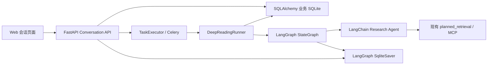
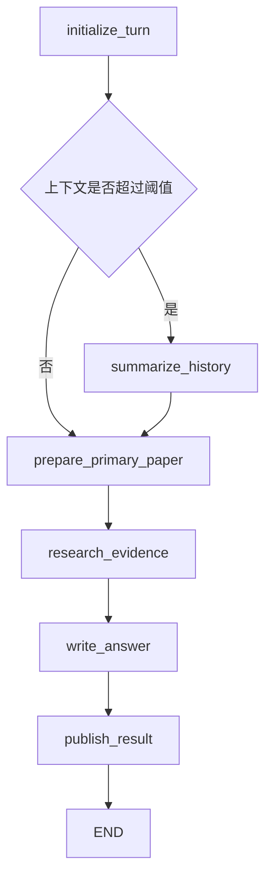

# PaperPilot 会话与 LangGraph 纵向切片设计

> Codex only：本文记录截至 2026-08-07 已逐节确认的设计。它是下一阶段的实施依据，不代表已经安装依赖、修改数据库、切换接口或开始迁移。

## 1. 背景与目标

PaperPilot 当前 Web 真实执行路径仍然是：

```text
POST /api/tasks
  -> TaskExecutor / Celery
  -> WorkflowRunner.run_real(task_id)
  -> paperpilot.conversation.run(question)
  -> 每个 Task 新建 ConversationSession
```

这条路径能完成单次论文问答，但 Web/Celery 每次执行都会创建新的会话对象，因此无法形成真实的连续追问。业务数据库目前只有用户、登录 Session、任务、事件和 Artifact，也没有用户可见的 Conversation、Message、论文集合与会话分支。

本阶段要交付的不是孤立的表或空 Graph 骨架，而是一条可以实际使用的端到端纵向切片：

1. 用户通过论文标题、作者、关键词、arXiv URL 或 arXiv ID 搜索论文，并明确选择主论文。
2. 用户创建 Conversation；`conversation.id` 同时作为 LangGraph `thread_id`。
3. 每轮提问创建一条 User Message 和一个 `research_tasks` 运行记录。
4. Celery 或本地执行器调用新的 LangGraph 运行时生成回复。
5. Assistant Message、任务 Artifact、相关论文和最终 checkpoint 被可靠关联。
6. 后续提问从当前会话头 checkpoint 继续，形成真实多轮上下文。
7. 用户可以无模型调用地切换到历史 Assistant Message；下一次提问从对应 checkpoint 创建非破坏性分支。
8. Web 页面默认展示当前线性路径，并在分叉位置提供“其他版本”选择，不展示复杂树状图。

## 2. 已确认的范围

### 2.1 本阶段包含

- SQLAlchemy 业务模型与 Alembic 增量迁移。
- Conversation、Message、Paper、ConversationPaper 数据模型。
- `research_tasks` 与 Conversation、checkpoint 的关联字段。
- LangGraph 最小论文精读 Graph。
- LangChain 模型、结构化输出和受限 Research Agent。
- 独立 SQLite LangGraph Checkpointer。
- 真实连续追问、会话恢复、历史切换和后续分支。
- 论文搜索、会话、消息和回滚 API。
- 继续复用现有任务事件轮询接口显示进度。
- 最小可用的 Web 会话界面。
- 不调用付费模型的自动化测试；真实模型只做经用户单独批准的烟雾测试。

### 2.2 本阶段不包含

- LangGraph Store 与跨 Conversation 用户画像、偏好、重要声明。
- 完整最终版论文精读 SOP，例如多轮覆盖评估、引用校验和复杂人工中断。
- 拆分或重写 `planned_retrieval` 内部检索算法。
- token 级流式输出、SSE 或 WebSocket。
- 任务取消、多个并行回复或同一 Conversation 内并行运行。
- 删除旧 `/api/tasks`、旧 `WorkflowRunner`、CLI、Eval 或旧 Agent 代码。
- 将 SQLite 改成 PostgreSQL。
- 全量前端框架迁移。
- 为旧任务自动生成 Conversation 或 Message 的数据回填。

旧 `/api/tasks` 在本阶段继续走旧运行时；只有新的 Conversation API 进入 LangGraph 路径。这样可以先验证完整产品闭环，而不是一次替换所有入口。

## 3. 产品概念与持久化边界

用户可见的产品概念为：

- **Paper**：可被多个用户和会话复用的公开论文元数据。
- **Conversation**：以一篇主论文为锚点、可扩展到多篇关联论文的阅读会话。
- **Message**：用户与助手可见的消息树。
- **Research Task**：生成一轮 Assistant 回复的后台运行记录。
- **Checkpoint**：LangGraph 在某个 `thread_id` 下保存的内部状态快照。

三类“记忆/存储”必须严格区分：

| 数据 | 存储位置 | 用途 |
| --- | --- | --- |
| 用户、论文、Conversation、Message、Task、事件、Artifact | SQLAlchemy 业务 SQLite | 产品数据、权限、列表和展示 |
| Graph State、消息上下文、节点状态、checkpoint history | LangGraph `SqliteSaver` SQLite | 连续追问、恢复、历史选择和分支 |
| 用户画像、跨会话偏好、重要声明 | 未来的 LangGraph Store SQLite | 长期记忆；本阶段不实现 |

不需要额外建立“用户名—LangGraph thread”映射表。业务关系已经是：

```text
users.id
  -> conversations.user_id
  -> conversations.id == LangGraph thread_id
```

所有 Checkpointer 访问必须先通过业务数据库验证 Conversation 所有权，不能让前端直接查询 Checkpointer。

## 4. 目标运行架构



### 4.1 新增代码边界

首个版本采用小而直接的功能包：

```text
paperpilot/deep_reading/
├── __init__.py
├── state.py
├── schemas.py
├── graph.py
├── nodes.py
├── research_agent.py
└── runner.py
```

- `state.py`：只定义 LangGraph `DeepReadingState`。
- `schemas.py`：定义节点输入输出和结构化模型结果的 Pydantic 契约。
- `graph.py`：只注册节点、固定边和条件边，不写 SQL、Prompt 或检索实现。
- `nodes.py`：实现每个明确的业务阶段；复杂度增长后再按阶段拆文件。
- `research_agent.py`：创建 LangChain Agent、配置模型和工具预算，不创建第二套独立 Checkpointer。
- `runner.py`：Web/Celery 与 Graph 之间的唯一运行边界，负责可信运行上下文、调用、恢复、事件映射和最终业务事务。

Web 侧延续现有结构，并只做必要拆分：

```text
paperpilot/web/
├── app.py                    # 挂载路由与应用生命周期
├── db_models.py              # 新增业务表和 Task 字段
├── task_store.py             # 逐步增加本切片所需的事务方法
├── conversation_routes.py    # 新 Conversation/Paper API
├── checkpoint.py             # SqliteSaver 创建、setup 和关闭
├── task_executor.py          # 允许按 Task 路由到新 Runner
├── worker_tasks.py           # Celery 子进程惰性创建 Runner/Saver
└── static/                   # 最小会话界面
```

不建立 Ports、Adapters、Repository 或自定义工作流框架。`DeepReadingRunner` 是必要的进程/事务边界，不再在它外面套一层通用 Repository。

### 4.2 可信运行上下文

以下数据来自 API、业务数据库和 Worker，不允许模型修改：

- `user_id`
- `conversation_id` / `thread_id`
- `task_id`
- `current_user_message_id`
- `base_checkpoint_id`
- 执行预算、允许工具集合和模型配置

它们通过 LangGraph Runtime context 或 Runner 闭包传递，不作为模型可写 State 字段。Graph State 中可以保存用于幂等关联的 ID 副本，但节点不能相信模型生成的身份或权限信息。

## 5. 最小 LangGraph 工作流

论文精读属于“固定宏观 SOP + 局部受控涌现”。首个纵向切片不复制完整旧循环，也不一次实现最终版 SOP，而是建立下面的原生 Graph：



### 5.1 节点职责

#### `initialize_turn`

- 读取当前 User Message 与请求参数。
- 校验 Conversation、主论文和当前 Task 的关联。
- 将本轮字段覆盖为当前 Task 数据。
- 从 checkpoint 中延续历史消息、会话摘要和当前活跃论文集合。

#### `summarize_history`

- 只在估算上下文超过配置阈值时运行。
- 用结构化输出生成事实性会话摘要。
- 保留最近若干轮原始消息，并在 State 中更新 `conversation_summary`。
- 不删除业务数据库里的任何 Message，也不改写旧 checkpoint。
- 该节点会产生模型成本，因此不能每轮无条件运行。

#### `prepare_primary_paper`

- 根据业务数据库中的规范化 Paper 引用准备主论文。
- 复用现有下载、解析、索引与文档能力。
- 对同一论文的已有可复用成果执行幂等检查。

#### `research_evidence`

- 使用 LangChain `create_agent`。
- 第一阶段把现有 `planned_retrieval` 作为兼容工具调用。
- Agent 可以决定查询和工具调用顺序，但受到工具白名单、步数、token 和失败重试预算约束。
- 返回经过 Pydantic 校验的 `ResearchResult`。
- Agent 搜到但没有实际用于证据、比较或引用的论文不写入 ConversationPaper。

#### `write_answer`

- 使用主论文、实际采用的关联论文、证据和会话上下文生成 `AnswerDraft`。
- 通过 LangChain structured output 获得可验证结构，再渲染为 Assistant Message。
- 首个版本允许结果为 `complete` 或 `partial`；证据不足时必须在结果中明确说明，不能伪造引用。

#### `publish_result`

- 是 Graph 内唯一允许发布最终产品结果的节点。
- 以 `task_id` 幂等写入或复用 Assistant Message、结果 Artifact 和实际使用的 ConversationPaper。
- 不直接决定最终会话头；Graph 返回并取得最终 checkpoint 后，由 Runner 的最终事务统一更新 Task 和 Conversation。

### 5.2 `DeepReadingState`

首个版本使用 `TypedDict`，保持小、可序列化、可版本化：

```python
class DeepReadingState(TypedDict, total=False):
    schema_version: int
    graph_version: str
    messages: list[dict[str, object]]
    conversation_summary: dict[str, object] | None

    current_task_id: str
    current_user_message_id: str
    primary_paper_id: str
    active_paper_ids: list[str]

    evidence_items: list[dict[str, object]]
    answer_draft: dict[str, object] | None
    published_message_id: str | None
    error: dict[str, object] | None
```

约束：

- `messages` 使用 LangGraph/LangChain 官方消息 reducer 所接受的 JSON 兼容表示。
- Pydantic 对象写入 State 前使用 `model_dump(mode="json")`，读取时使用 `model_validate`。
- 不把数据库 Session、文件句柄、模型客户端、Saver 或任意可执行对象写入 State。
- 每轮的 `current_*`、证据、草稿、发布结果和错误字段必须显式覆盖，不能误用上一轮值。
- `schema_version=1`；新增可选字段必须有安全默认值，不支持的旧版本要显式拒绝或迁移，不能静默误读。

## 6. 业务数据模型

现有五张表 `users`、`sessions`、`research_tasks`、`task_events`、`task_artifacts` 保留。通过 Alembic 只做增量扩展。

### 6.1 `papers`

| 字段 | 说明 |
| --- | --- |
| `id` | PaperPilot 内部 UUID |
| `source` | 首版为 `arxiv` |
| `external_id` | 规范化 arXiv ID；保留用户显式选择的版本号 |
| `title` | 标题 |
| `authors_json` | 作者列表 JSON |
| `abstract` | 摘要，可空 |
| `source_url` | 规范化来源 URL |
| `created_at` / `updated_at` | 时间戳 |

约束：`UNIQUE(source, external_id)`。公开论文元数据允许跨用户复用；本表不保存用户私有批注，也不在本阶段保存 PDF 全文。

### 6.2 `conversations`

| 字段 | 说明 |
| --- | --- |
| `id` | Conversation UUID，同时是 LangGraph `thread_id` |
| `user_id` | 所有者 |
| `primary_paper_id` | 主论文 |
| `title` | 用户可编辑标题 |
| `head_message_id` | 当前有效路径末端的完整 Assistant Message；新会话可空 |
| `head_checkpoint_id` | 与 `head_message_id` 对应的 checkpoint；新会话可空 |
| `created_at` / `updated_at` | 时间戳 |
| `archived_at` | 软归档时间，可空 |

`head_message_id` 与 `head_checkpoint_id` 必须成对更新。运行中的 User Message 不移动 Conversation head，因此 head 始终表示一个可以继续运行或回滚的稳定点。

### 6.3 `conversation_papers`

| 字段 | 说明 |
| --- | --- |
| `conversation_id` / `paper_id` | Conversation 与 Paper |
| `role` | `primary`、`comparison`、`citation`、`background`、`follow_up` |
| `added_by` | `user` 或 `agent` |
| `source_task_id` | 首次采用该论文的 Task，可空 |
| `source_message_id` | 首次采用该论文的 Assistant Message，可空 |
| `is_active` | 当前 head 对应路径是否激活 |
| `created_at` | 时间戳 |

约束：`UNIQUE(conversation_id, paper_id)`。主论文创建会话时立即写入并始终激活。Agent 发现的论文只有在答案中实际用于证据、比较或引用时才写入；普通搜索候选不写入。

历史路径使用过哪些论文保存在相应 checkpoint 的 `active_paper_ids` 中。切换历史 head 时，业务表的 `is_active` 与目标 checkpoint 同步，不删除其他论文关联。

### 6.4 `messages`

| 字段 | 说明 |
| --- | --- |
| `id` | Message UUID |
| `conversation_id` | 所属 Conversation |
| `task_id` | 产生该轮消息的 Task；系统消息可空 |
| `parent_message_id` | 消息树父节点，可空 |
| `role` | `user`、`assistant`、`system` |
| `content` | 用户可见正文 |
| `status` | 首版为 `complete` 或 `failed` |
| `metadata_json` | 引用、结构化结果摘要等扩展信息 |
| `created_at` | 时间戳 |

父子关系为：

```text
历史 Assistant head
  -> 本轮 User Message
  -> 本轮 Assistant Message
```

第一条 User Message 的 parent 为空。`UNIQUE(task_id, role)` 防止 Worker 重投时重复发布同一轮 User/Assistant Message；`task_id` 为空的系统消息不受影响。

默认消息列表从 `conversations.head_message_id` 反向沿 `parent_message_id` 读取，再按时间正序展示。运行中或失败的当前 User Message 通过 Task 状态单独附加到界面，不把不稳定点误当作可恢复 head。

### 6.5 扩展 `research_tasks`

新增可空字段：

| 字段 | 说明 |
| --- | --- |
| `conversation_id` | 新会话运行所属 Conversation；旧 Task 为 `NULL` |
| `base_checkpoint_id` | 本轮开始时选择的 checkpoint；首轮可空 |
| `final_checkpoint_id` | 本轮成功结束后的 checkpoint；失败时可空 |
| `result_quality` | `complete` 或 `partial`；旧 Task 可空 |

保留现有 `pending`、`running`、`completed`、`failed` 状态。首版不增加 `waiting_input`、`cancelled` 或新的 runs 表。

SQLite 使用部分唯一索引保证一个 Conversation 同时最多存在一个活动 Task：

```sql
CREATE UNIQUE INDEX ...
ON research_tasks(conversation_id)
WHERE conversation_id IS NOT NULL
  AND status IN ('pending', 'running');
```

应用层检查用于返回友好的 `409`，数据库索引用于阻止竞态。

### 6.6 Alembic 策略

- 只新增表、可空字段、外键和索引。
- 不删除现有列、表或数据。
- 不回填旧 Task；它们继续通过旧 API 读取。
- migration 必须从包含真实旧数据的数据库副本升级并验证旧记录仍可访问。
- 数据库 Schema 只由 Alembic 管理；不能在请求首次到达时执行临时 DDL。

## 7. API 设计

### 7.1 搜索与选择论文

```http
GET /api/papers/search?q=<title|author|keywords|arxiv-url|arxiv-id>&limit=10
```

- 调用结构化 arXiv 查询，不调用 LLM。
- 返回 `source`、`external_id`、标题、作者、摘要和 URL。
- 输入为 URL 或 ID 时先规范化并优先精确查找。
- 搜索只返回候选，不自动创建 Conversation。

```http
POST /api/conversations
Content-Type: application/json

{
  "paper": {"source": "arxiv", "external_id": "..."},
  "title": null
}
```

服务端重新获取或校验规范化论文元数据，在同一业务事务中 upsert Paper、创建 Conversation 和 primary ConversationPaper。用户不需要理解内部 Paper UUID。

### 7.2 Conversation 管理

```http
GET   /api/conversations
GET   /api/conversations/{conversation_id}
PATCH /api/conversations/{conversation_id}
```

- 列表默认不返回已归档会话，可用查询参数选择。
- 详情返回主论文、当前 head、活跃论文、当前活动 Task 和最近更新时间。
- `PATCH` 首版只修改标题或软归档状态。
- 对不存在和不属于当前用户的资源统一返回 `404`，避免泄漏 ID 是否存在。

### 7.3 消息列表与分支选择

```http
GET /api/conversations/{conversation_id}/messages
GET /api/conversations/{conversation_id}/messages/{message_id}/alternatives
```

- 默认消息接口只返回当前 active path。
- alternatives 以某个历史 Assistant Message 为分叉点，返回其直接子 User Message 及已经完成的 Assistant 回复。
- 选择某个版本的实质是调用 rollback，将 head 切到该选项的 Assistant Message；不会删除其他分支。
- 如果一个分支还有更深的历史，前端进入该版本后可继续逐个分叉点浏览；首版不计算或绘制全局分支树。

### 7.4 提交一轮消息

```http
POST /api/conversations/{conversation_id}/messages
Content-Type: application/json

{
  "content": "这篇论文的方法和另一篇工作相比有什么优势？",
  "depth": "standard",
  "expected_head_message_id": "...或 null"
}
```

服务端流程：

1. 校验认证用户拥有 Conversation，且未归档。
2. 校验不存在 `pending` 或 `running` Task。
3. 校验 `expected_head_message_id` 等于数据库当前 head；不一致返回 `409`，防止多个标签页覆盖。
4. 向 TaskExecutor 预留容量；容量不足时不写业务数据。
5. 在同一业务事务中创建 User Message、ResearchTask 和 queued TaskEvent；Task 的 `base_checkpoint_id` 取当前 `head_checkpoint_id`。
6. 提交给本地执行器或 Celery。
7. 返回 `202 Accepted`，包含 User Message、Task ID 和当前稳定 head。
8. 如果提交动作在持久化后同步失败，补偿事务把 Task 标记为 `failed` 并写失败事件；Conversation head 不移动。

现有接口继续承担进度轮询：

```http
GET /api/tasks/{task_id}/updates
```

客户端使用现有事件和 Artifact 显示阶段进度；Task 完成后重新拉取 Conversation messages，显示最终完整 Assistant Message。首版不做 token 流。

### 7.5 切换历史状态

```http
POST /api/conversations/{conversation_id}/rollback
Content-Type: application/json

{
  "message_id": "目标 assistant message id",
  "expected_head_message_id": "当前 head id"
}
```

尽管 API 名称为 rollback，它执行的是非破坏性“切换当前 head”：

1. 校验 Conversation 所有权、未归档且没有活动 Task。
2. 校验乐观并发字段 `expected_head_message_id`。
3. 校验目标是同一 Conversation 中 `complete` 的 Assistant Message。
4. 通过目标 Message 的 Task 找到 `final_checkpoint_id`。
5. 使用 `thread_id + checkpoint_id` 从 Checkpointer 读取快照，确认存在且 schema 受支持。
6. 在一个业务事务中更新 Conversation 的 head 二元组，并按目标 State 同步 ConversationPaper `is_active`。
7. 不调用模型、不创建新 checkpoint、不删除消息、不删除旧 checkpoint，也不产生 token 成本。

下一次提交消息时，新的 User Message 以该 Assistant Message 为 parent，Task 以它的 checkpoint 为 `base_checkpoint_id`。Runner 从该历史 checkpoint invoke，LangGraph 创建新的后续 checkpoint 路径。

同一 Conversation 有活动 Task 时，提交消息和 rollback 都返回 `409`；不同 Conversation 可以并行运行。首版不支持取消正在运行的 Task。

## 8. Runner、Checkpoint 与事务一致性

### 8.1 Graph 调用

Runner 为每个 Task 构造可信上下文，并使用：

```python
configurable = {"thread_id": conversation.id}
if task.base_checkpoint_id is not None:
    configurable["checkpoint_id"] = task.base_checkpoint_id
config = {"configurable": configurable}
```

- 首轮没有 `base_checkpoint_id`，从空 State 开始。
- 正常后续从当前 head checkpoint 开始。
- rollback 后续从历史 checkpoint 开始，形成分支。
- 外层 Graph 是唯一业务 Checkpointer；内部 LangChain Agent 不建立独立持久化时间线。

在实现前必须用实际选定版本编写契约测试，确认 `SqliteSaver` 在指定历史 `checkpoint_id` 后 invoke 时，新 checkpoint 的 parent 和原分支保留行为符合本设计。不能仅依赖接口名称推断。

### 8.2 成功发布

成功路径分为两个幂等阶段：

1. `publish_result` 以 Task ID 写入或复用 Assistant Message、Artifact 和实际采用的 Paper 关联。
2. Graph 完成并写出最终 checkpoint 后，Runner 读取最终 `StateSnapshot` 的 checkpoint ID，在一个业务事务中：
   - 写入 `research_tasks.final_checkpoint_id`；
   - 写入 `result_quality`；
   - 将 Task 置为 `completed`；
   - 更新 Conversation `head_message_id`；
   - 更新 Conversation `head_checkpoint_id`；
   - 同步 ConversationPaper `is_active`；
   - 写入完成事件。

Assistant Message 与 Artifact 必须使用 Task ID 唯一约束或等价 upsert。Worker 重投时不得创建重复回复。

### 8.3 失败与恢复矩阵

| 失败位置 | 恢复行为 |
| --- | --- |
| Graph 调用前 | 原子 claim Task；未 claim 或已完成则安全退出 |
| 模型、工具或结构化输出暂时失败 | 节点/Agent 按有限预算重试；超过预算后失败 |
| checkpoint 写入失败 | 不完成最终 head 事务，抛出基础设施异常供 Celery 重试 |
| Assistant 已发布、最终 checkpoint 尚未取得 | 重试复用 Task 对应 Message/Artifact，再完成 Graph |
| Graph 已完成、业务数据库最终事务失败 | 从该 thread 的最新 checkpoint 恢复 finalization，不重复发布 |
| Celery 消息重复投递 | 原子 claim、Task 状态和 Task-ID 幂等约束共同去重 |
| checkpoint 损坏或 schema 不支持 | Task 标记 `failed`，记录可诊断事件，不静默从错误状态继续 |

新的 Runner 对需要 Worker 重试的数据库、Checkpointer 和进程级错误必须重新抛出。不能沿用旧 `WorkflowRunner` 把异常全部吞掉并只改 Task 状态的做法。

如果 Graph 已完成但 `research_tasks.final_checkpoint_id` 尚未提交，恢复逻辑只接受该 `thread_id` 下 State 的 `current_task_id` 与当前 Task 相等、`published_message_id` 可解析且 Graph 版本受支持的最新 checkpoint；任何条件不满足都进入可诊断失败，不能把其他轮次的 checkpoint 错认成本轮结果。

### 8.4 SQLite Checkpointer 生命周期

正式运行使用独立文件：

```text
data/langgraph/checkpoints.sqlite3
```

建议配置项为 `PAPERPILOT_LANGGRAPH_CHECKPOINT_DB_PATH`，默认指向上述路径。

- Uvicorn 进程创建自己的同步 `SqliteSaver` 实例和连接，并在应用关闭时显式关闭。
- 每个 Celery 子进程在使用时惰性创建自己的 Saver/连接，不能继承父进程打开的 SQLite 连接。
- 连接使用 30 秒 busy timeout 和 WAL；实际 PRAGMA 支持情况要通过集成测试确认。
- Checkpointer 自己的表由显式 setup 步骤初始化，部署启动前执行，避免多个首次请求同时建表。
- readiness 检查业务数据库、Checkpoint 数据库和执行器是否可用；liveness 不依赖外部模型。
- `SqliteSaver` 适合当前本地/轻并发形态，但必须做 Uvicorn + 多 Celery 子进程并发探针。若写锁成为瓶颈，再单独评审 PostgreSQL Checkpointer，不在本阶段提前迁移。

## 9. 依赖、模型与安全

### 9.1 建议依赖范围

截至设计确认时，建议安装并锁定到以下兼容小版本范围：

```text
langgraph>=1.2.9,<1.3
langchain>=1.3.14,<1.4
langgraph-checkpoint-sqlite>=3.1,<3.2
langchain-deepseek>=1.1,<1.2
pydantic>=2.13,<3
```

这些是设计目标，不在设计阶段执行安装。实施时必须由锁文件解析出具体版本，运行导入、Graph、Saver 重启与安全配置测试后再提交依赖变更。

### 9.2 DeepSeek 模型边界

- 通过官方 `langchain-deepseek` 的 `ChatDeepSeek` 接入。
- 需要工具调用与 structured output 的节点使用 `deepseek-chat`。
- 首版不把 `deepseek-reasoner` 用于 Research Agent；当前官方集成说明中它不适合本设计依赖的工具调用与结构化输出组合。
- 自动化测试使用 fake model 和 fake tools，不读取真实 API key，也不产生模型费用。

### 9.3 Checkpoint 安全

- 启用 `LANGGRAPH_STRICT_MSGPACK=true`。
- State 只保存消息、JSON 对象和安全基础类型。
- 不把用户输入当作 Checkpointer metadata filter、SQL 片段或配置键。
- API 不暴露原始 Checkpointer 查询、metadata filter 或任意 `checkpoint_id` 枚举。
- 使用 `langgraph-checkpoint-sqlite>=3.1`，避开已修复的 metadata filter SQL 注入问题。
- 使用已包含严格 msgpack 修复的 LangGraph 版本，并通过自定义对象反序列化拒绝测试验证 allowlist。

参考：

- [LangGraph persistence](https://docs.langchain.com/oss/python/langgraph/persistence)
- [LangGraph time travel](https://docs.langchain.com/oss/python/langgraph/use-time-travel)
- [LangChain agents](https://docs.langchain.com/oss/python/langchain/agents)
- [LangChain DeepSeek integration](https://docs.langchain.com/oss/python/integrations/chat/deepseek)
- [SQLite Checkpointer SQL injection advisory](https://github.com/langchain-ai/langgraph/security/advisories/GHSA-9rwj-6rc7-p77c)
- [LangGraph msgpack advisory](https://github.com/langchain-ai/langgraph/security/advisories/GHSA-g48c-2wqr-h844)

## 10. 长对话上下文策略

- 业务数据库始终保留完整 Message 树，作为产品展示和审计来源。
- Checkpoint 保留历史 StateSnapshot，不通过删除旧 checkpoint 实现压缩。
- 当前 State 使用 `conversation_summary + 最近若干轮原始消息` 控制模型上下文。
- `initialize_turn` 先估算当前模型所需上下文；只有超过阈值才进入 `summarize_history`。
- 摘要采用 Pydantic 结构，至少保存已确认事实、用户当前问题脉络、论文结论、比较对象和未解决问题。
- 摘要不是用户画像；不得写入未来的 Store。
- 摘要失败时可以在安全 token 上限内回退到截取最近消息，但必须记录事件，不能无限携带历史。

## 11. Web 最小交互

在现有静态 HTML/CSS/JavaScript 基础上增加会话模式，不引入新的前端框架：

1. 左侧显示 Conversation 列表、主论文标题、最近更新时间与运行状态。
2. 新建 Conversation 时显示统一搜索框，接受标题、作者、关键词、arXiv URL 或 ID；用户从结构化候选中明确选择。
3. 主区域默认显示当前 active path。
4. 底部输入框提交新问题；活动 Task 期间禁用再次发送和 rollback。
5. 回复过程中沿用 `/api/tasks/{id}/updates` 展示阶段事件；完成后一次显示完整 Assistant Message。
6. 分叉位置提供“其他版本”选择器；切换前调用 rollback API，不绘制完整树图。
7. API 返回 `409` 时显示“会话已在其他页面更新”或“当前回复仍在生成”，重新拉取会话，而不是自动覆盖。
8. 失败的 Task 以失败状态附加显示，并允许用户在稳定 head 上重新提问。

旧 Task 列表和详情在兼容期保留，是否调整导航在实施计划中做最小布局安排，不删除既有功能。

## 12. 验证策略

### 12.1 单元测试

单元测试可以使用：

```python
from langgraph.checkpoint.memory import InMemorySaver
```

`InMemorySaver` 只作为进程内测试替身，用于快速验证节点、State 合并、条件边和两轮上下文。它不能进入 PaperPilot 正式配置，不能用于重启恢复或真实回滚验证。

单元测试覆盖：

- Pydantic 输入输出校验与非法结构拒绝。
- Graph 固定路径和条件摘要路径。
- fake model、fake tools 和 Research Agent 预算。
- 连续两轮使用同一 `thread_id` 时读取上轮上下文。
- 每轮临时字段不会泄漏。
- publish 按 Task ID 幂等。

### 12.2 真实 SQLite Saver 集成测试

所有持久化承诺必须使用真实 `SqliteSaver` 验证：

- 关闭并重新创建 Saver 后恢复同一 Conversation。
- 指定历史 checkpoint 后 invoke，产生新分支且原分支仍可读取。
- rollback 本身不创建 checkpoint、不调用模型。
- Message、Task `final_checkpoint_id` 和 Conversation head 一致。
- Uvicorn 进程与多个 Celery 子进程使用独立连接并发访问。
- setup、WAL、busy timeout、关闭与重新打开。
- 严格 msgpack 拒绝非允许对象。

### 12.3 业务数据库与 API 测试

- 从旧版五表数据库运行 Alembic upgrade，旧用户、登录 Session、Task、Event、Artifact 均保留。
- User Message、Task 和 queued event 的事务原子性。
- Assistant Message、Artifact、相关论文和最终 head 的幂等 finalization。
- 数据库部分唯一索引阻止同一 Conversation 两个活动 Task。
- 乐观 head 冲突返回 `409`。
- 跨用户访问 Conversation、Message、Task、rollback 均返回 `404`。
- arXiv URL/ID 规范化和搜索候选不自动入库。
- 只有实际使用的关联论文写入 ConversationPaper。
- 旧 `/api/tasks` 行为保持兼容。

### 12.4 故障窗口测试

至少注入两个关键崩溃窗口：

1. Assistant Message 已写入，但 Graph 最终 checkpoint/Runner finalization 未完成。
2. Graph 最终 checkpoint 已存在，但业务数据库 finalization 提交失败。

重投后都必须得到：一个 User Message、一个 Assistant Message、一个结果 Artifact、一个 completed Task，以及一致的最终 head。

### 12.5 前端与全量验证

- 使用 fake runner 完成搜索、创建会话、提交、轮询、显示回复、二次追问、rollback 和分支切换流程。
- 运行前端静态资源检查和后端全部测试。
- 不自动运行真实 DeepSeek；真实模型烟雾测试必须单独说明预计调用并取得用户批准。

## 13. 实施顺序与迁移开关

详细文件级步骤在下一份实施计划中编写。总体顺序固定为：

1. 锁定依赖并建立 Checkpointer 契约测试。
2. 添加 Alembic migration、SQLAlchemy 模型和事务方法。
3. 实现 `deep_reading` State、Pydantic schema、Graph 和 fake 测试。
4. 实现 `SqliteSaver` 生命周期、重启、fork 与并发测试。
5. 实现 Conversation/Paper API 与新的 Worker 路由。
6. 实现幂等发布、失败恢复和端到端测试。
7. 增加最小 Web 会话界面。
8. 运行旧 API 回归和全量测试。

新 Conversation API 自身就是迁移边界，不把旧 `/api/tasks` 暗中切换到新 Graph。只有纵向切片通过验收后，后续阶段才讨论 CLI、Eval 和旧 Web Task 入口的迁移或删除。

## 14. 验收标准

本阶段只有同时满足以下条件才算完成：

1. 用户无需提供内部 ID，即可搜索并选择 arXiv 论文创建 Conversation。
2. 同一 Conversation 连续两次真实提交时，第二轮 Graph 从第一轮 checkpoint 延续。
3. Web 重启和 Worker 重启后，会话和 checkpoint 仍能恢复。
4. 选择历史 Assistant Message 不触发模型调用，下一问形成新分支，原分支数据仍存在。
5. 默认 UI 只显示当前线性路径，且可以从分叉点切换其他版本。
6. 一个 Conversation 同时只有一个活动 Task，不同 Conversation 可并行。
7. 业务数据库、Message、Task 和 checkpoint 的关联在故障重试后保持幂等一致。
8. 旧用户和旧 Task 不丢失，旧 `/api/tasks` 仍可使用。
9. 自动化测试不调用付费模型；所有相关测试与全量回归通过。

## 15. 主要风险与后续决策

- **SQLite 多进程写竞争**：通过 WAL、busy timeout、每进程连接和压力测试控制；超出当前负载后再评审 PostgreSQL。
- **业务数据库与 Checkpointer 无法组成一个数据库事务**：通过 Task-ID 幂等、分阶段发布和可恢复 finalization 解决，而不是伪装成强一致分布式事务。
- **Graph 版本演进**：State 必须带 schema/graph version，并保留旧 checkpoint fixture 做升级测试。
- **长对话成本**：摘要只在阈值触发；未来需要基于实际 token、质量和价格数据调整。
- **现有 `planned_retrieval` 仍较重**：本阶段优先确保迁移行为稳定；内部拆分作为后续独立项目，并建立检索质量回归。
- **未来 Store 记忆**：需要另行设计提取、确认、撤销、namespace 和成本策略，不能混入本阶段 checkpoint 或 Conversation summary。

本文确认的是可工作的第一条 LangGraph 产品闭环。它刻意保留旧入口并限制首版 SOP，但 Conversation、Message、Checkpoint 和非破坏性分支的数据关系将作为后续各模块升级的稳定基础。
